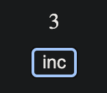

## React VanillaState

Musings on how to enable use of vanilla JS classes to track state in React components. Avoid React specific logic within the state management classes that define state and mutations.

### Sample API

The intent is to decouple state logic from React code, such that you can write something that is easier to reason about, without reference to specifics of the React framework. In an ideal world, I would be able to do something like this:

```typescript
import { VanillaState, useVanillaState } from "./module"

class Counter extends VanillaState {
  count = 0
  get state() {
    return this.count
  }
  increment() {
    this.count += 1
    return this
  }
  decrement() {
    this.count -= 1
    return this
  }
}

export default function App() {
  const counter = useVanillaState(Counter)

  return (
    <div className="App">
      {counter.state}

      <button
        onClick={() => {
          // Sample state change chain
          // with rerender() after mutations are done:
          counter.increment().decrement().increment().rerender()
        }}
      >
        inc
      </button>
    </div>
  )
}
```

### Try it locally

```bash
$ git clone ...
$ cd use-vanilla-state
$ yarn install && yarn start
```

Click the button to increment the count, proving that this sample module can at least work in the simplest of cases.


